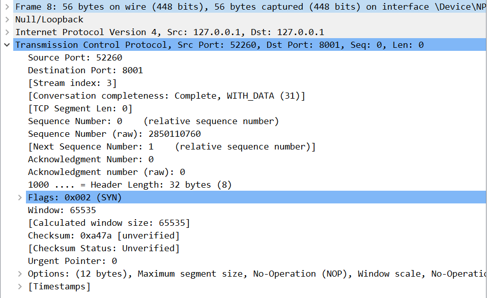

计算机网络实验报告（二）
==================================

-----

>专业：计算机科学与技术
>学号：2011188
>姓名：邵琦


<!-- @import "[TOC]" {cmd="toc" depthFrom=1 depthTo=6 orderedList=false} -->

<!-- code_chunk_output -->

- [一、实验要求](#一-实验要求)
- [二、Web服务器的搭建](#二-web服务器的搭建)
- [三、报文](#三-报文)
  - [3.1 TCP报文](#31-tcp报文)
    - [3.1.1 物理层数据帧概况](#311-物理层数据帧概况)
    - [3.1.2 数据层头部信息](#312-数据层头部信息)
    - [3.1.3 互联网层IP包头部信息](#313-互联网层ip包头部信息)
    - [3.1.4 传输层数据段头部信息](#314-传输层数据段头部信息)
  - [3.2 HTTP报文](#32-http报文)
    - [3.2.1 HTTP请求报文](#321-http请求报文)
    - [3.2.2 HTTP响应报文](#322-http响应报文)
- [四、wireshark捕获](#四-wireshark捕获)
  - [4.1 三次握手](#41-三次握手)
  - [4.2 http请求](#42-http请求)
  - [4.3 四次挥手](#43-四次挥手)

<!-- /code_chunk_output -->


# 一、实验要求

（1）搭建Web服务器（自由选择系统），并制作简单的Web页面，包含简单文本信息（至少包含专业、学号、姓名）和自己的LOGO。

（2）通过浏览器获取自己编写的Web页面，使用Wireshark捕获浏览器与Web服务器的交互过程，并进行简单的分析说明。

（3）提交实验报告。

# 二、Web服务器的搭建

html文件如下：

```
<!DOCTYPE html>
<html lang="en">
<head>
    <meta charset="UTF-8">
    <meta http-equiv="X-UA-Compatible" content="IE=edge">
    <meta name="viewport" content="width=device-width, initial-scale=1.0">
    <title>Document</title>
</head>
<body>
    <h1>专业：计算机科学与技术</h1>
    <h1>姓名：邵琦</h1>
    <h1>学号：2011188</h1>
    
</body>
</html>
```

js文件如下：

```
//引入http模块
var http=require('http');
var fs=require('fs');
var url=require('url');
//创建服务
var server=http.createServer(function(req,res){
    var url=req.url;
    if(url==='/'){
        fs.readFile('lab2.html',(err,data)=>{
            if(err){
                res.setHeader('Content-Type','text/plain;charset=utf-8');
				res.end('文件读取失败');
            }else{
				res.setHeader('Content-Type','text/html;charset=utf-8');
				res.end(data);
            }
        });
    }else {
		fs.readFile('SHOXIE.jpg',(err,data)=>{
			if(err){
				res.setHeader('Content-Type','text/plain;charset=utf-8');
				res.end('文件读取失败');
			}else{
				res.setHeader('Content-Type','image/jpeg');
				res.end(data);
			}
		});
    }
}).listen(8001);
console.log('Server running at http://127.0.0.1:8001/');
```

用html文件与js文件搭建服务器，在集成终端运行后，在浏览器中输入"http://127.0.0.1:8001/"即可进入该网站，该网站包括了姓名、学号、专业，以及自己设计的一张图片，其截图如下：


# 三、报文

## 3.1 TCP报文

如图所示，TCP报文分为四部分：


### 3.1.1 物理层数据帧概况


### 3.1.2 数据层头部信息

由于是本地回环，所以头部并没有什么信息。


### 3.1.3 互联网层IP包头部信息


这部分信息包含：指明为IPV4协议，包头长度为20bytes，IP包总长度为52，标识字段58678，标记字段为0x2，生存周期为128，包内封装的上层协议为TCP，头部校验和，源IP地址（127.0.0.1），目的IP地址（127.0.0.1）。

### 3.1.4 传输层数据段头部信息



这部分信息包含：源端口，目的端口，标志为SYN（发送SYN报文到服务器），seq=0（此处分析的是第一次握手）

## 3.2 HTTP报文

### 3.2.1 HTTP请求报文


这部分信息在原有的TCP基础上增加了差文本传输协议部分。

请求行指明方法为GET，HTTP版本为HTTP1.1，指明请求源host为127.0.0.1:8001，连接类型，一些Cookie信息。


### 3.2.2 HTTP响应报文


响应报文的消息格式又在HTTP请求报文中增加了响应体，包含请求需要得到的数据，这里是HTML文件内容。

# 四、wireshark捕获

在实验中首先开启Wireshark，并开启抓包，在浏览器中输入自己设计的网页的网址，观察Wireshark界面如下图所示：


由于客户端和服务器都是本机，所以我们选择“Adapter for loopback traffic capture”进入。进入后我们使用过滤器，取出本机端口与本机交互的数据包显示，以分析浏览器与Web服务器的交互过程。


TCP协议提供的是按序、可靠的服务，是一种面向连接的传输方式，即其发送数据之前发送方和接收放需要握手，断开链接时需要四次挥手。

## 4.1 三次握手

首先，TCP进行三次握手：

第一次握手：客户端发送syn包(seq=x)到服务器，并进入SYN_SEND状态，等待服务器确认；

第二次握手：服务器收到syn包，必须确认客户的SYN(ack=x+1)，同时自己也发送一个SYN包(seq=y)，即SYN+ACK包，此时服务器进入SYN_RECV状态；

第三次握手：客户端收到服务器的SYN+ACK包，向服务器发送确认包ACK(ack=y+1)，此包发送完毕，客户端和服务器进入ESTABLISHED状态，完成三次握手。


握手过程中传送的包里不包含数据，三次握手完毕后，客户端与服务器才正式开始传送数据。


如上图所示，即为tcp的三次握手过程：

首先由52260向8001端口发送了一条syn包，并令seq = x = 0（本机初始序列号），报文长度为0，滑动窗口为65535，最大窗口长度为65495，窗口扩大因子为256，此时浏览进入了SYN_SEND状态，这是第一次握手；

然后服务器8001端口接收到了浏览器发送的syn包后，确认客户的syn，使ack = x + 1 = 1，seq = y = 0，对序列号为1（ack）之前的报文进行确认，同时向客户发送一个（syn，ack）包，其中报文长度为0，滑动窗口为65535，最大窗口长度为65495，这是第二次握手；

客户端接受到了服务器发送的（syn，ack）包后，客户端向服务器返回确认包，其中ack = y + 1 = 1，滑动窗口为327424，报文长度为0，这是第三次握手。至此三次握手完成，服务器和客户端建立了联系。

## 4.2 http请求

通过TCP三次握手后，建立了连接。开始进行数据交互。


首先可以看出，使用http1.1协议首先发送一个访问页面的get请求，客户端收到get请求后将所请求内容发送给客户端。


## 4.3 四次挥手

最后，TCP进行四次挥手：

第一次挥手：主动断开方发送一个FIN，用来关闭数据传送，主动断开方进入FIN_WAIT_1状态。

第二次挥手：被动断开方收到FIN后，发送一个ACK给主动断开方，确认序号为收到序号+1（与SYN相同，一个FIN占用一个序号），服务器进入CLOSE_WAIT状态。

第三次挥手：被动断开方发送一个FIN，用来关闭服务器到主动断开方的数据传送，服务器进入LAST_ACK状态。

第四次挥手：主动断开方收到FIN后，主动断开方进入TIME_WAIT状态，接着发送一个ACK给服务器，确认序号为收到序号+1，服务器进入CLOSED状态，完成四次挥手。


如上图所示，即为tcp四次挥手过程。

首先，服务器向客户端发送了一条请求结束的报文（FIN，ACK），报文序列号为seq = x = 17759，ack = y = 1381，报文长度为0，这是第一次挥手；

然后客户端接收到了发送的FIN包后，对收到的报文进行确认，其报文序列号为seq = y = 1381，ack = x + 1 = 17759 + 1 = 17760，这是第二次挥手；

然后客户端再向服务器发送一个FIN包，其内容与前一个基本相同，用来关闭服务器端到客户端的数据传送，这是第三次挥手；

服务器对收到的fin包进行确认，客户端进入关闭状态，这是第四次挥手。至此tcp的四次挥手结束，客户端和服务器断开连接，访问结束。