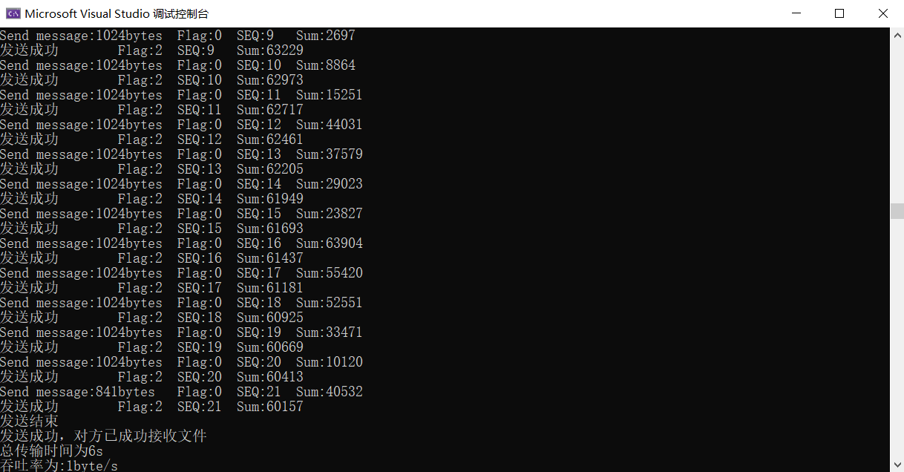

计算机网络实验报告（三）（1）
==================================

-----

>专业：计算机科学与技术
>学号：2011188
>姓名：邵琦


<!-- @import "[TOC]" {cmd="toc" depthFrom=1 depthTo=6 orderedList=false} -->

<!-- code_chunk_output -->

- [一、实验要求](#一-实验要求)
  - [具体要求：](#具体要求)
- [二、实验设计](#二-实验设计)
  - [2.1 建立连接&断开连接](#21-建立连接断开连接)
    - [三次握手建立连接](#三次握手建立连接)
    - [四次挥手断开连接](#四次挥手断开连接)
  - [2.2 数据传输](#22-数据传输)
- [三、代码实现](#三-代码实现)
  - [3.1 报文格式](#31-报文格式)
  - [3.2 计算校验和](#32-计算校验和)
    - [发送方生成检验和](#发送方生成检验和)
    - [接收方校验检验和](#接收方校验检验和)
  - [3.3 建立连接（三次握手）](#33-建立连接三次握手)
    - [服务器端](#服务器端)
    - [客户端](#客户端)
  - [3.4 断开连接（四次挥手）](#34-断开连接四次挥手)
    - [服务器端](#服务器端-1)
    - [客户端](#客户端-1)
  - [3.5 数据传输](#35-数据传输)
    - [服务器端（接收）](#服务器端接收)
    - [客户端（发送）](#客户端发送)
      - [发送单个数据包](#发送单个数据包)
      - [发送文件](#发送文件)
- [四、实验结果](#四-实验结果)
  - [4.1 三次挥手建立连接](#41-三次挥手建立连接)
  - [4.2 数据传输](#42-数据传输)
  - [4.3 四次挥手断开连接](#43-四次挥手断开连接)

<!-- /code_chunk_output -->


# 一、实验要求

基于UDP服务设计可靠传输协议并编程实现（1）

利用数据报套接字在用户空间实现面向连接的可靠数据传输，功能包括：建立连接、差错检测、确认重传等。流量控制采用停等机制，完成给定测试文件的传输。

## 具体要求：

1. 实现单向传输。

2. 对于每一个任务要求给出详细的协议设计。

3. 给出实现的拥塞控制算法的原理说明。

4. 完成给定测试文件的传输，显示传输时间和平均吞吐率。

5. 性能测试指标：吞吐率、时延，给出图形结果并进行分析。

6. 完成详细的实验报告（每个任务完成一份）。

7. 编写的程序应结构清晰，具有较好的可读性。

8. 提交程序源码和实验报告。


# 二、实验设计

## 2.1 建立连接&断开连接

### 三次握手建立连接

1. 第一次握手：客户端给服务端发一个SYN报文，并指明客户端的初始化序列号ISN。此时客户端处于SYN_SENT状态。

2. 第二次握手：服务器收到客户端的SYN报文之后，会以自己的SYN报文作为应答，并且也指定了自己的初始化序列号ISN(s)。同时会把客户端的ISN+1作为ACK的值，表示自己已经收到了客户端的SYN，此时服务器处于SYN_RCVD的状态。在确认报文段中SYN=1，ACK=1，确认号ACK=x+1，初始序号SEQ=y。

3. 第三次握手：客户端收到SYN报文之后，会发送一个ACK报文，当然，也是一样把服务器的ISN+1作为ACK的值，表示已经收到了服务端的SYN报文，此时客户端处ESTABLISHED状态。服务器收到ACK报文之后，也处于ESTABLISHED状态。
   
4. 此时，双方已建立起了连接。


### 四次挥手断开连接

1. 第一次挥手：客户端发送一个FIN报文，报文中会指定一个序列号。此时客户端处于FIN_WAIT1状态。即发出连接释放报文段（FIN=1，序号seq=u），并停止再发送数据，主动关闭TCP连接，进入FIN_WAIT1（终止等待1）状态，等待服务端的确认。

2. 第二次挥手：服务端收到FIN之后，会发送ACK报文，且把客户端的序列号值+1作为ACK报文的序列号值，表明已经收到客户端的报文了，此时服务端处于CLOSE_WAIT状态。即服务端收到连接释放报文段后即发出确认报文段（ACK=1，确认号ack=u+1，序号seq=v），服务端进入CLOSE_WAIT（关闭等待）状态，此时的TCP处于半关闭状态，客户端到服务端的连接释放。客户端收到服务端的确认后，进入FIN_WAIT2（终止等待2）状态，等待服务端发出的连接释放报文段。

3. 第三次挥手：如果服务端也断开连接，和客户端的第一次挥手一样，发给FIN报文，且指定一个序列号。此时服务端处于LAST_ACK的状态。
即服务端没有要向客户端发出的数据，服务端发出连接释放报文段（FIN=1，ACK=1，序号seq=w，确认号ack=u+1），服务端进入LAST_ACK（最后确认）状态，等待客户端的确认。

4. 第四次挥手：客户端收到FIN之后，一样发送一个ACK报文作为应答，且把服务端的序列号值+1作为自己ACK报文的序列号值，此时客户端处于TIME_WAIT状态。需要过一阵子以确保服务端收到自己的ACK报文之后才会进入CLOSED状态，服务端收到ACK报文之后，就处于关闭连接了，处于CLOSED状态。即客户端收到服务端的连接释放报文段后，对此发出确认报文段（ACK=1，seq=u+1，ack=w+1），客户端进入TIME_WAIT（时间等待）状态。此时TCP未释放掉，需要经过时间等待计时器设置的时间2MSL后，客户端才进入CLOSED状态。

5. 此时，双方已断开了连接。


## 2.2 数据传输

发送端和接收端的接收机均采用rdt3.0进行数据传输。


数据在传输时，将一个文件分为数个包进行分段传输，每个包的内容为数据头+数据。在传输时，需要接受到上一个发送包序号的ACK=1才能发送下一个数据包；接收端接收到了一个数据包，先要进行校验，如果检查无误，则向发送放返回该序列号的ACK=1。在一定时间内，如果没有收到该序列号的ACK=1，将会重新传输该包。如果接收端收到了重复的包裹，则将其中一个丢弃，但仍需要向发送方发送该序列号的ACK=1。在最后，发送方需要向接收端发送一个FIN=1，ACK=1，SYN=1的包裹，表示文件传输结束；接收端收到该包裹后，需要向发送方返回一个ACK=1，表示收到文件传输结束的信号。


# 三、代码实现

## 3.1 报文格式


报文头长度为48位

前16位为数据长度，用于记录数据区的大小

17-32位为校验和，用于检验传输的正确性

33-40位为标志位，只使用低3位，分别为FIN，ACK，SYN

40-48位为传输的数据包的序号，0-255循环使用

```c++
const int MAXSIZE = 1024;//传输缓冲区最大长度
const unsigned char SYN = 0x1;          //SYN = 1 ACK = 0
const unsigned char ACK = 0x2;          //SYN = 0, ACK = 1
const unsigned char ACK_SYN = 0x3;      //SYN = 1, ACK = 1
const unsigned char FIN = 0x4;          //FIN = 1 ACK = 0
const unsigned char FIN_ACK = 0x6;      //FIN = 1 ACK = 1
const unsigned char OVER = 0x7;         //结束标志
double MAXTIMEOUT = CLOCKS_PER_SEC;//最大时延

#pragma pack(1)
//报文格式
struct HEADER
{
	u_short sum = 0;//校验和（16位）
	u_short datasize = 0;//数据长度（16位）
	unsigned char flag = 0;//FIN，ACK，SYN（8位）
	unsigned char seq = 0;//传输序列号（8位）
	HEADER()
	{
		sum = 0;
		datasize = 0;
		flag = 0;
		seq = 0;
	}
};
#pragma pack()
```

## 3.2 计算校验和

### 发送方生成检验和

1. 发送方将发送的进行检验和运算的数据分成若干个16位的位串，每个位串看成一个二进制数。

2. 将首部中的检验和字段置为0，该字段也参与检验和运算。

3. 对这些16位的二进制数进行1的补码和运算，累加的结果再取反码即生成了检验码。将检验码放入检验和字段中。其中1的补码和运算，即带循环进位的加法，最高位有进位应循环进到最低位。

### 接收方校验检验和

1. 接收方将接收的数据(包括检验和字段)按发送方的同样的方法进行1的补码和运算，累加的结果再取反码。

2. 进行校验，如果结果为0，表示传输正确；否则，说明传输有差错。

```C++
//差错检测：计算校验和
u_short CheckSum(u_short* message, int size)
{
	int count = (size + 1) / 2;
	u_short* buffer = (u_short*)malloc(size + 1);
	memset(buffer, 0, size + 1);
	memcpy(buffer, message, size);
	u_long sum = 0;
	while (count != 0)
	{
		sum += *buffer;
		buffer++;
		count--;
		if (sum & 0xffff0000)
		{
			sum &= 0xffff;
			sum++;
		}
	}
	return ~(sum & 0xffff);
}
```

## 3.3 建立连接（三次握手）

### 服务器端

```c++
//建立连接
int Connect(SOCKET& sockServ, SOCKADDR_IN& ClientAddr, int& ClientAddrLen)
{
	HEADER header;
	char* buffer = new char[sizeof(header)];
	//第一次握手（接收）
	while (1)
	{
		if (recvfrom(sockServ, buffer, sizeof(header), 0, (SOCKADDR*)&ClientAddr, &ClientAddrLen) == -1)
		{
			cout << 1 << endl;
			return 0;
		}
		memcpy(&header, buffer, sizeof(header));
		if (header.flag == SYN && CheckSum((u_short*)&header, sizeof(header)) == 0)
		{
			cout << "第一次握手成功" << endl;
			break;
		}
	}

	//第二次握手（发送）
	header.flag = ACK_SYN;
	header.sum = 0;
	header.sum = CheckSum((u_short*)&header, sizeof(header));
	memcpy(buffer, &header, sizeof(header));
	if (sendto(sockServ, buffer, sizeof(header), 0, (sockaddr*)&ClientAddr, ClientAddrLen) == -1)
	{
		return 0;
	}
	clock_t start = clock();//发送时间

	//第三次握手（接收）
	while (recvfrom(sockServ, buffer, sizeof(header), 0, (sockaddr*)&ClientAddr, &ClientAddrLen) <= 0)
	{
		if (clock() - start > MAXTIMEOUT)
		{
			header.flag = ACK_SYN;
			header.sum = 0;
			header.sum = CheckSum((u_short*)&header, sizeof(header));
			memcpy(buffer, &header, sizeof(header));
			if (sendto(sockServ, buffer, sizeof(header), 0, (sockaddr*)&ClientAddr, ClientAddrLen) == -1)
			{
				return 0;
			}
			cout << "第二次握手超时，正在重传" << endl;
		}
	}
	cout << "第二次握手成功" << endl;
	HEADER temp_header;
	memcpy(&temp_header, buffer, sizeof(temp_header));
	if (temp_header.flag == ACK && CheckSum((u_short*)&temp_header, sizeof(temp_header)) == 0 )
	{
		cout << "第三次握手成功" << endl;
	}
	else
	{
		cout << "连接发生错误！" << endl;
		return 0;
	}
	cout << "三次握手结束，连接成功" << endl;
	return 1;
}
```

### 客户端

```c++
int Connect(SOCKET& socketClient, SOCKADDR_IN& servAddr, int& servAddrlen)
{
	HEADER header;
	char* buffer = new char[sizeof(header)];
	//第一次握手（发送）
	header.flag = SYN;
	header.sum = 0;
	header.sum = CheckSum((u_short*)&header, sizeof(header));
	memcpy(buffer, &header, sizeof(header));
	if (sendto(socketClient, buffer, sizeof(header), 0, (sockaddr*)&servAddr, servAddrlen) == -1)
	{
		return 0;
	}
	//cout << "第一次握手成功" << endl;
	clock_t start = clock();
	//设置为非阻塞的socket
	u_long mode = 1;
	ioctlsocket(socketClient, FIONBIO, &mode);

	//第二次握手（接收）
	while (recvfrom(socketClient, buffer, sizeof(header), 0, (sockaddr*)&servAddr, &servAddrlen) <= 0)
	{
		if (clock() - start > MAXTIMEOUT)//超时，重新传输第一次握手
		{
			header.flag = SYN;
			header.sum = 0;
			header.sum = CheckSum((u_short*)&header, sizeof(header));
			memcpy(buffer, &header, sizeof(header));
			sendto(socketClient, buffer, sizeof(header), 0, (sockaddr*)&servAddr, servAddrlen);
			start = clock();
			cout << "第一次握手超时，正在重传" << endl;
		}
	}
	cout << "第一次握手成功" << endl;
	memcpy(&header, buffer, sizeof(header));
	if (header.flag == ACK_SYN  && CheckSum((u_short*)&header, sizeof(header)) == 0)
	{
		cout << "第二次握手成功" << endl;
	}
	else
	{
		cout << "连接发生错误！" << endl;
		return 0;
	}

	//第三次握手（发送）
	header.flag = ACK;	
	header.sum = 0;
	header.sum = CheckSum((u_short*)&header, sizeof(header));
	if (sendto(socketClient, (char*)&header, sizeof(header), 0, (sockaddr*)&servAddr, servAddrlen) == -1)
	{
		return 0;
	}
	cout << "第三次握手成功" << endl;
	cout << "三次握手结束，连接成功" << endl;
}
```

## 3.4 断开连接（四次挥手）

### 服务器端

```c++
int DisConnect(SOCKET& sockServ, SOCKADDR_IN& ClientAddr, int& ClientAddrLen)
{
	HEADER header;
	char* buffer = new char[sizeof(header)];
	//第一次挥手（接收）
	while (1)
	{
		if (recvfrom(sockServ, buffer, sizeof(header) + MAXSIZE, 0, (sockaddr*)&ClientAddr, &ClientAddrLen) == -1)
		{
			return 0;
		}
		memcpy(&header, buffer, sizeof(header));
		if (header.flag == FIN && CheckSum((u_short*)&header, sizeof(header)) == 0)
		{
			cout << "第一次挥手成功" << endl;
			break;
		}
	}

	//第二次挥手（发送）
	header.flag = ACK;
	header.sum = 0;
	header.sum = CheckSum((u_short*)&header, sizeof(header));
	memcpy(buffer, &header, sizeof(header));
	if (sendto(sockServ, buffer, sizeof(header), 0, (sockaddr*)&ClientAddr, ClientAddrLen) == -1)
	{
		return 0;
	}

	//第三次挥手（发送）
	header.flag = FIN_ACK;
	header.sum = 0;
	header.sum = CheckSum((u_short*)&header, sizeof(header));
	memcpy(buffer, &header, sizeof(header));
	if (sendto(sockServ, buffer, sizeof(header), 0, (sockaddr*)&ClientAddr, ClientAddrLen) == -1)
	{
		return 0;
	}
	clock_t start = clock();

	//第四次挥手（接收）
	while (recvfrom(sockServ, buffer, sizeof(header), 0, (sockaddr*)&ClientAddr, &ClientAddrLen) <= 0)
	{
		if (clock() - start > MAXTIMEOUT)
		{
			header.flag = ACK;
			header.sum = 0;
			header.sum = CheckSum((u_short*)&header, sizeof(header));
			memcpy(buffer, &header, sizeof(header));
			if (sendto(sockServ, buffer, sizeof(header), 0, (sockaddr*)&ClientAddr, ClientAddrLen) == -1)
			{
				return 0;
			}
			header.flag = FIN_ACK;
			header.sum = 0;
			header.sum = CheckSum((u_short*)&header, sizeof(header));
			memcpy(buffer, &header, sizeof(header));
			if (sendto(sockServ, buffer, sizeof(header), 0, (sockaddr*)&ClientAddr, ClientAddrLen) == -1)
			{
				return 0;
			}
			cout << "第二/三次挥手超时，正在重传" << endl;
		}
	}
	cout << "第二次&第三次挥手成功" << endl;
	HEADER temp_header;
	memcpy(&temp_header, buffer, sizeof(header));
	if (temp_header.flag == ACK && CheckSum((u_short*)&temp_header, sizeof(temp_header)) == 0)
	{
		cout << "第四次挥手成功" << endl;
	}
	else
	{
		cout << "连接发生错误！" << endl;
		return 0;
	}

	cout << "四次挥手结束，连接断开" << endl;
	return 1;
}
```

### 客户端

```c++
int DisConnect(SOCKET& socketClient, SOCKADDR_IN& servAddr, int& servAddrlen)
{
	HEADER header;
	char* buffer = new char[sizeof(header)];
	//第一次挥手（发送）
	header.flag = FIN;
	header.sum = 0;
	header.sum = CheckSum((u_short*)&header, sizeof(header));
	memcpy(buffer, &header, sizeof(header));
	if (sendto(socketClient, buffer, sizeof(header), 0, (sockaddr*)&servAddr, servAddrlen) == -1)
	{
		return 0;
	}
	clock_t start = clock();
	u_long mode = 1;
	ioctlsocket(socketClient, FIONBIO, &mode);

	//第二次挥手（接收）
L: while (recvfrom(socketClient, buffer, sizeof(header), 0, (sockaddr*)&servAddr, &servAddrlen) <= 0)
{
	if (clock() - start > MAXTIMEOUT)
	{
		header.flag = FIN;
		header.sum = 0;
		header.sum = CheckSum((u_short*)&header, sizeof(header));
		memcpy(buffer, &header, sizeof(header));
		sendto(socketClient, buffer, sizeof(header), 0, (sockaddr*)&servAddr, servAddrlen);
		start = clock();
		cout << "第一次挥手超时，正在重传" << endl;
	}
}
cout << "第一次挥手成功" << endl;
memcpy(&header, buffer, sizeof(header));
if (header.flag == ACK && CheckSum((u_short*)&header, sizeof(header)) == 0)
{
	cout << "第二次挥手成功" << endl;
}
else
{
	cout << "连接发生错误！" << endl;
	return 0;
}
start = clock();

//第三次挥手（接收）
while (recvfrom(socketClient, buffer, sizeof(header), 0, (sockaddr*)&servAddr, &servAddrlen) <= 0)
{
	if (clock() - start > MAXTIMEOUT)
	{
		header.flag = FIN;
		header.sum = 0;
		header.sum = CheckSum((u_short*)&header, sizeof(header));
		memcpy(buffer, &header, sizeof(header));
		sendto(socketClient, buffer, sizeof(header), 0, (sockaddr*)&servAddr, servAddrlen);
		start = clock();
		cout << "第三次挥手超时，正在重传" << endl;
		goto L;
	}
}
memcpy(&header, buffer, sizeof(header));
if (header.flag == FIN_ACK && CheckSum((u_short*)&header, sizeof(header)) == 0)
{
	cout << "第三次挥手成功" << endl;
}
else
{
	cout << "连接发生错误！" << endl;
	return 0;
}

//第四次挥手（发送）
header.flag = ACK;
header.sum = 0;
header.sum = CheckSum((u_short*)&header, sizeof(header));
if (sendto(socketClient, (char*)&header, sizeof(header), 0, (sockaddr*)&servAddr, servAddrlen) == -1)
{
	return 0;
}
cout << "第四次挥手成功" << endl;
cout << "四次挥手结束，连接断开" << endl;
return 1;
}
```

## 3.5 数据传输

### 服务器端（接收）

```c++
int ReceiveMessage(SOCKET& sockServ, SOCKADDR_IN& ClientAddr, int& ClientAddrLen, char* message)
{
	HEADER header;
	int FileLen = 0;
	char* buffer = new char[MAXSIZE + sizeof(header)];
	int seq = 0;
	while (1)
	{
		int len = recvfrom(sockServ, buffer, sizeof(header) + MAXSIZE, 0, (sockaddr*)&ClientAddr, &ClientAddrLen);
		memcpy(&header, buffer, sizeof(header));
		if (header.flag == OVER && CheckSum((u_short*)&header, sizeof(header)) == 0)//判断是否结束
		{
			cout << "文件接收成功" << endl;
			break;
		}
		if (header.flag == unsigned char(0) && CheckSum((u_short*)buffer, len) == 0)
		{
			if (seq != int(header.seq))//判断是否接受的是别的包
			{
				//返回ACK
				header.flag = ACK;
				header.datasize = 0;
				header.seq = (unsigned char)seq;
				header.sum = 0;
				header.sum = CheckSum((u_short*)&header, sizeof(header));
				memcpy(buffer, &header, sizeof(header));
				//重发ACK
				sendto(sockServ, buffer, sizeof(header), 0, (sockaddr*)&ClientAddr, ClientAddrLen);
				cout << "Send to Client\tACK:" << (int)header.seq << "\tSEQ:" << (int)header.seq << endl;
				continue;//丢弃数据包
			}
			seq = (int)header.seq;
			if (seq > 255)
			{
				seq -= 256;//seq:0~255
			}
			//取出buffer中的内容
			cout << "Receive message:" << len - sizeof(header) << "bytes" << "\tFlag:" << int(header.flag) << "\tSEQ:" << int(header.seq) << "\tSum:" << int(header.sum) << endl;
			char* temp = new char[len - sizeof(header)];
			memcpy(temp, buffer + sizeof(header), len - sizeof(header));
			memcpy(message + FileLen, temp, len - sizeof(header));
			FileLen += int(header.datasize);
			//返回ACK
			header.flag = ACK;
			header.datasize = 0;
			header.seq = (unsigned char)seq;
			header.sum = 0;
			header.sum = CheckSum((u_short*)&header, sizeof(header));
			memcpy(buffer, &header, sizeof(header));
			//重发ACK
			sendto(sockServ, buffer, sizeof(header), 0, (sockaddr*)&ClientAddr, ClientAddrLen);
			cout << "Send to Client" << "\tACK:" << int(header.seq) << "\tSEQ:" << int(header.seq) << endl;
			seq++;
			if (seq > 255)
			{
				seq -= 256;
			}
		}
	}
	//结束
	header.flag = OVER;
	header.sum = 0;
	header.sum = CheckSum((u_short*)&header, sizeof(header));
	memcpy(buffer, &header, sizeof(header));
	if (sendto(sockServ, buffer, sizeof(header), 0, (sockaddr*)&ClientAddr, ClientAddrLen) == -1)
	{
		return 0;
	}
	return FileLen;
}
```

### 客户端（发送）

#### 发送单个数据包

```c++
//发送单个数据包
void SendPacket(SOCKET& socketClient, SOCKADDR_IN& servAddr, int& servAddrlen, char* message, int len, int& order)
{
	HEADER header;
	char* buffer = new char[MAXSIZE + sizeof(header)];
	header.datasize = len;
	header.seq = unsigned char(order);//序列号
	header.flag = unsigned char(0x0);
	memcpy(buffer, &header, sizeof(header));
	memcpy(buffer + sizeof(header), message, sizeof(header) + len);
	header.sum = CheckSum((u_short*)buffer, sizeof(header) + len);
	memcpy(buffer, &header, sizeof(header));
	sendto(socketClient, buffer, len + sizeof(header), 0, (sockaddr*)&servAddr, servAddrlen);
	cout << "Send message:" << len << "bytes" << "\tFlag:" << int(header.flag) << "\tSEQ:" << int(header.seq) << "\tSum:" << int(header.sum) << endl;
	clock_t start = clock();
	//接收ACK等信息
	while (1)
	{
		u_long mode = 1;
		ioctlsocket(socketClient, FIONBIO, &mode);
		while (recvfrom(socketClient, buffer, MAXSIZE, 0, (sockaddr*)&servAddr, &servAddrlen) <= 0)
		{
			if (clock() - start > MAXTIMEOUT)
			{
				header.datasize = len;
				header.seq = unsigned char(order);
				header.flag = unsigned char(0x0);
				memcpy(buffer, &header, sizeof(header));
				memcpy(buffer + sizeof(header), message, sizeof(header) + len);
				//header.sum = 0;
				header.sum = CheckSum((u_short*)buffer, sizeof(header) + len);
				memcpy(buffer, &header, sizeof(header));
				sendto(socketClient, buffer, len + sizeof(header), 0, (sockaddr*)&servAddr, servAddrlen);
				cout << "发送超时，正在重传" << endl;
				cout<<"Resend message:"<<len<<"bytes"<<"\tFlag:"<<int(header.flag)<<"\tSEQ:" << int(header.seq) << "\tSum:" << int(header.sum) << endl;
				start = clock();
			}
		}
		memcpy(&header, buffer, sizeof(header));
		if (header.seq == unsigned char(order) && header.flag == ACK)
		{
			cout<<"发送成功"<< "\tFlag:" << int(header.flag) << "\tSEQ:" << int(header.seq) << "\tSum:" << int(header.sum) << endl;
			break;
		}
	}
	u_long mode = 0;
	ioctlsocket(socketClient, FIONBIO, &mode);//改回阻塞模式
}
```

#### 发送文件

```c++
//发送整个文件
void Send(SOCKET& socketClient, SOCKADDR_IN& servAddr, int& servAddrlen, char* message, int len)
{
	int PacketNum;
	int seqnum = 0;
	if (len % MAXSIZE == 0)
	{
		PacketNum = len / MAXSIZE;
	}
	else
	{
		PacketNum = len / MAXSIZE + 1;
	}
	for (int i = 0; i < PacketNum; i++)
	{
		int templen;
		if (PacketNum == i + 1)
		{
			templen = len - i * MAXSIZE;
		}
		else
		{
			templen = MAXSIZE;
		}
		//cout << message<<endl;
		SendPacket(socketClient, servAddr, servAddrlen, message + i * MAXSIZE, templen, seqnum);
		seqnum++;
		if (seqnum > 255)
		{
			seqnum -= 256;
		}
	}
	//发送结束信息
	HEADER header;
	char* buffer = new char[sizeof(header)];
	header.flag = OVER;
	header.sum = 0;
	header.sum = CheckSum((u_short*)&header, sizeof(header));
	memcpy(buffer, &header, sizeof(header));
	sendto(socketClient, buffer, sizeof(header), 0, (sockaddr*)&servAddr, servAddrlen);
	cout << "发送结束" << endl;
	clock_t start = clock();
	while (1)
	{
		u_long mode = 1;
		ioctlsocket(socketClient, FIONBIO, &mode);
		while (recvfrom(socketClient, buffer, MAXSIZE, 0, (sockaddr*)&servAddr, &servAddrlen) <= 0)
		{
			if (clock() - start > MAXTIMEOUT)
			{
				char* buffer = new char[sizeof(header)];
				header.flag = OVER;
				header.sum = 0;
				header.sum = CheckSum((u_short*)&header, sizeof(header));
				memcpy(buffer, &header, sizeof(header));
				sendto(socketClient, buffer, sizeof(header), 0, (sockaddr*)&servAddr, servAddrlen);
				cout << "结束超时，正在重传" << endl;
				start = clock();
			}
		}
		memcpy(&header, buffer, sizeof(header));
		if (header.flag == OVER)
		{
			cout << "发送成功，对方已成功接收文件" << endl;
			break;
		}
	}
	u_long mode = 0;
	ioctlsocket(socketClient, FIONBIO, &mode);
}
```

# 四、实验结果

## 4.1 三次挥手建立连接


## 4.2 数据传输




## 4.3 四次挥手断开连接


