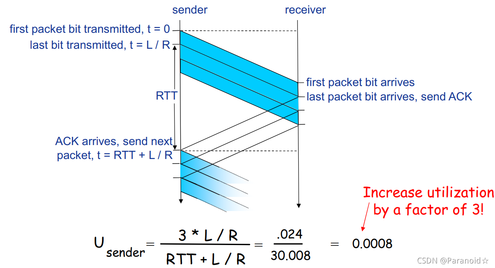
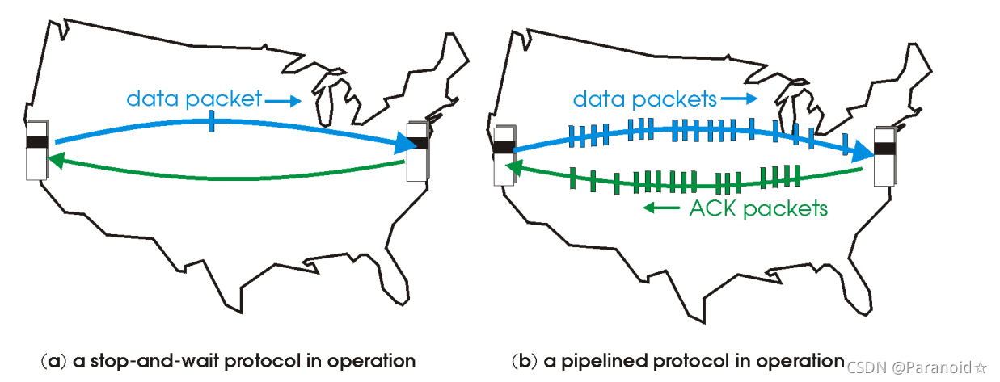
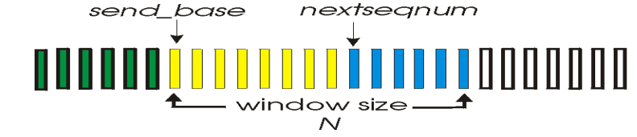
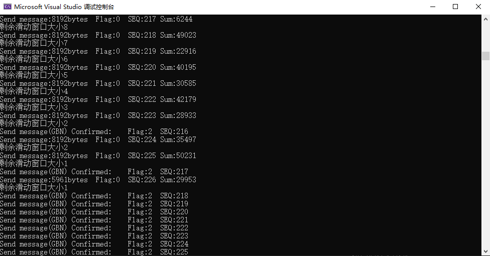

计算机网络实验报告（三）（1）
==================================

-----

>专业：计算机科学与技术
>学号：2011188
>姓名：邵琦


<!-- @import "[TOC]" {cmd="toc" depthFrom=1 depthTo=6 orderedList=false} -->

<!-- code_chunk_output -->

- [计算机网络实验报告（三）（1）](#计算机网络实验报告三1)
- [一、实验要求](#一实验要求)
	- [具体要求：](#具体要求)
- [二、实验设计](#二实验设计)
	- [2.1 流水线协议](#21-流水线协议)
	- [2.2 滑动窗口协议](#22-滑动窗口协议)
	- [2.3 累计确认](#23-累计确认)
	- [2.4 其他设计](#24-其他设计)
- [三、代码实现](#三代码实现)
	- [滑动窗口大小定义](#滑动窗口大小定义)
	- [传输数据](#传输数据)
		- [发送单个数据包](#发送单个数据包)
		- [发送数据（GBN）](#发送数据gbn)
- [四、实验结果](#四实验结果)

<!-- /code_chunk_output -->


# 一、实验要求

基于UDP服务设计可靠传输协议并编程实现（2）

在实验3-1的基础上，将停等机制改成基于滑动窗口的流量控制机制，采用固定窗口大小，支持累积确认，完成给定测试文件的传输。

## 具体要求：

1. 实现单向传输。

2. 对于每一个任务要求给出详细的协议设计。

3. 给出实现的拥塞控制算法的原理说明。

4. 完成给定测试文件的传输，显示传输时间和平均吞吐率。

5. 性能测试指标：吞吐率、时延，给出图形结果并进行分析。

6. 完成详细的实验报告（每个任务完成一份）。

7. 编写的程序应结构清晰，具有较好的可读性。

8. 提交程序源码和实验报告。

# 二、实验设计

## 2.1 流水线协议

Rdt3.0在停等操作过程中浪费了大量的时间，从而在Rdt3.0上引入了流水线机制，提高了资源利用率。

流水线协议允许发送方在收到ACK之前连续发送多个分组，更大的序列号范围，同时发送方和/或接收方需要更大的存储空间以缓存分组。





## 2.2 滑动窗口协议

滑动窗口协议：发送方和接收方各有一个缓存数组，发送方存放着已发送且成功确认包序号、已发送未确认包序号 ，未发送包序号。接收方存放着已接受包序号、正在接收包序号、未接收包序号。每个数组有个两个扫描指针，开头和结尾，一起向后扫描，两者形成一个窗口，所有被称为窗口协议。

滑动窗口协议(Sliding-window protocol)主要有两类协议：GBN(go-Back-N，回退N重传协议), SR(selective repeat，选择重传协议)。

滑动窗口结构如下：



滑动窗口分为左边界，发送边界以及右边界。窗口大小可以设定（固定），左边界左侧为已经发送并且得到确认的数据；左边界右侧到发送边界的数据为已发送但未得到确认的数据；发送边界到右边界为等待发送的数据；右边界右侧为不可发送的数据。

本实验采取GBN协议：

1. 分组头部包含k-bit序列号
2. 窗口尺寸为N，最多允许N个分组未确认
3. 确认ACK(n): 确认到序列号n(包含n)的分组均已被正确接收，可能收到重复ACK
4. 为传输的分组设置计时器(timer)，若超时Timeout(n): 重传序列号大于等于n，还未收到ACK的所有分组

## 2.3 累计确认

停等协议效率较低，很难使用其进行大量的数据包发送，所以使用流水线的方式进行数据包的发送和接受。GBN协议采用累计确认的方式，其中关键是发送方能够在收到确认之前发送多个分组，而接收方只能缓存一个分组。发送方为发送出去的分组保留副本，直到收到接收方确认收到。

## 2.4 其他设计

其他设计均与lab3-1相同，此处不再赘述。

# 三、代码实现

## 滑动窗口大小定义

首先，我们在开头定义滑动窗口的大小。

```c++
int SlidingWindow = 10;//滑动窗口大小
```

## 传输数据

### 发送单个数据包

发送单个数据包与之前实验类似，本处不再赘述。

```c++
void SendPacket(SOCKET& socketClient, SOCKADDR_IN& servAddr, int& servAddrlen, char* message, int len, int order)
{
	HEADER header;
	char* buffer = new char[MAXSIZE + sizeof(header)];
	header.datasize = len;
	header.seq = unsigned char(order);//序列号
	header.flag = unsigned char(0x0);
	memcpy(buffer, &header, sizeof(header));
	memcpy(buffer + sizeof(header), message, sizeof(header) + len);
	header.sum = CheckSum((u_short*)buffer, sizeof(header) + len);
	memcpy(buffer, &header, sizeof(header));
	sendto(socketClient, buffer, len + sizeof(header), 0, (sockaddr*)&servAddr, servAddrlen);
	cout << "Send message:" << len << "bytes" << "\tFlag:" << int(header.flag) << "\tSEQ:" << int(header.seq) << "\tSum:" << int(header.sum) << endl;
}
```

### 发送数据（GBN）

首先，我们需要定义滑动窗口头部与尾部，然后计算包数量，发送每个包并且发送当前滑动窗口剩余大小。之后接收接收端发送的ACK消息，先判断校验和以及消息类型是否为ACK，若不是，则调整tail位置并且重传消息，若是，则根据接收到的消息的seq消息，将head调整到seq之后。（原因是接收端无缓冲区，不会产生错序问题），若超时，则超时重传。最后发送结束消息，与先前实验类似，不再赘述。

```c++
void Send(SOCKET& socketClient, SOCKADDR_IN& servAddr, int& servAddrlen, char* message, int len)
{
	int GBN_Header = -1;//滑动窗口头部
	int GBN_Tail = 0;//滑动窗口尾部
	int PacketNum;
	if (len % MAXSIZE == 0)
	{
		PacketNum = len / MAXSIZE;
	}
	else
	{
		PacketNum = len / MAXSIZE + 1;
	}
	/*
	for (int i = 0; i < PacketNum; i++)
	{
		int templen;
		if (PacketNum == i + 1)
		{
			templen = len - i * MAXSIZE;
		}
		else
		{
			templen = MAXSIZE;
		}
		//cout << message<<endl;
		SendPacket(socketClient, servAddr, servAddrlen, message + i * MAXSIZE, templen, seqnum);
		seqnum++;
		if (seqnum > 255)
		{
			seqnum -= 256;
		}
	}
	*/
	HEADER header;
	char* buffer = new char[sizeof(header)];
	clock_t start;
	while (GBN_Header < PacketNum - 1)
	{
		if (GBN_Tail - GBN_Header < SlidingWindow && GBN_Tail != PacketNum)
		{
			int templen;
			if (PacketNum == GBN_Tail + 1)
			{
				templen = len - GBN_Tail * MAXSIZE;
			}
			else
			{
				templen = MAXSIZE;
			}
			SendPacket(socketClient, servAddr, servAddrlen, message + GBN_Tail * MAXSIZE, templen, (GBN_Tail%256));
			cout << "剩余滑动窗口大小" << SlidingWindow - (GBN_Tail - GBN_Head)<<endl;
			GBN_Tail++;
			start = clock();
		}
		u_long mode = 1;
		ioctlsocket(socketClient, FIONBIO, &mode);
		if (recvfrom(socketClient, buffer, sizeof(header), 0, (sockaddr*)&servAddr, &servAddrlen)>0)//缓冲区接收到信息
		{
			memcpy(&header, buffer, sizeof(header));//读取缓冲区
			if ((int(CheckSum((u_short*)&header, sizeof(header)))!=0) || header.flag != ACK)
			{
				GBN_Tail = GBN_Header + 1;
				cout << "GBN重传" << endl;
				continue;
			}
			else
			{
				if (int(header.seq) >= GBN_Header % 256)
				{
					GBN_Header = GBN_Header + int(header.seq) - GBN_Header % 256;
					cout << "Send message(GBN) Confirmed:" << "\tFlag:" << int(header.flag) << "\tSEQ:" << int(header.seq) << endl;
				}
				else if ((GBN_Header % 256 > 256 - SlidingWindow - 1) && (int(header.seq) < SlidingWindow))
				{
					GBN_Header = GBN_Header + 256 - GBN_Header % 256 + int(header.seq);
					cout << "Send message(GBN) Confirmed:" << "\tFlag:" << int(header.flag) << "\tSEQ:" << int(header.seq) << endl;
				}
			}
		}
		else
		{
			if (clock() - start > MAXTIMEOUT)
			{
				GBN_Tail = GBN_Header + 1;
				cout << "GBN重传" << endl;
			}
		}
		mode = 0;
		ioctlsocket(socketClient, FIONBIO, &mode);
	}

	//发送结束信息
	header.flag = OVER;
	header.sum = 0;
	header.sum = CheckSum((u_short*)&header, sizeof(header));
	memcpy(buffer, &header, sizeof(header));
	sendto(socketClient, buffer, sizeof(header), 0, (sockaddr*)&servAddr, servAddrlen);
	cout << "发送结束" << endl;
	start = clock();
	while (1)
	{
		u_long mode = 1;
		ioctlsocket(socketClient, FIONBIO, &mode);
		while (recvfrom(socketClient, buffer, MAXSIZE, 0, (sockaddr*)&servAddr, &servAddrlen) <= 0)
		{
			if (clock() - start > MAXTIMEOUT)
			{
				char* buffer = new char[sizeof(header)];
				header.flag = OVER;
				header.sum = 0;
				header.sum = CheckSum((u_short*)&header, sizeof(header));
				memcpy(buffer, &header, sizeof(header));
				sendto(socketClient, buffer, sizeof(header), 0, (sockaddr*)&servAddr, servAddrlen);
				cout << "结束超时，正在重传" << endl;
				start = clock();
			}
		}
		memcpy(&header, buffer, sizeof(header));
		if (header.flag == OVER)
		{
			cout << "发送成功，对方已成功接收文件" << endl;
			break;
		}
	}
	u_long mode = 0;
	ioctlsocket(socketClient, FIONBIO, &mode);
}
```

# 四、实验结果

三次握手、四次挥手、接收端接收消息与先前实验一样，此处不再赘述，只给出发送端实验截图。

