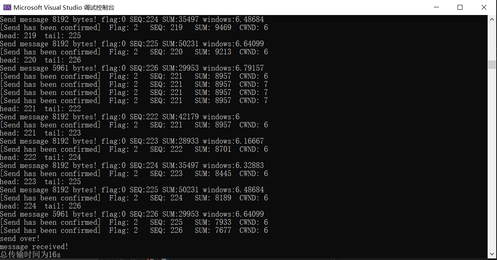

计算机网络实验报告（三）（3）
==================================

-----

>专业：计算机科学与技术
>学号：2011188
>姓名：邵琦


<!-- @import "[TOC]" {cmd="toc" depthFrom=1 depthTo=6 orderedList=false} -->

<!-- code_chunk_output -->

- [计算机网络实验报告（三）（3）](#计算机网络实验报告三3)
- [一、实验要求](#一实验要求)
  - [具体要求](#具体要求)
- [二、实验设计](#二实验设计)
  - [网络拥塞](#网络拥塞)
  - [拥塞控制](#拥塞控制)
  - [拥塞窗口](#拥塞窗口)
  - [拥塞控制窗口](#拥塞控制窗口)
- [三、代码实现](#三代码实现)
  - [相关定义](#相关定义)
  - [发送单个数据包](#发送单个数据包)
  - [发送数据](#发送数据)
- [四、实验结果](#四实验结果)

<!-- /code_chunk_output -->


# 一、实验要求

基于UDP服务设计可靠传输协议并编程实现（3）

在实验3-2的基础上，选择实现一种拥塞控制算法，也可以是改进的算法，完成给定测试文件的传输。

## 具体要求

1. 实现单向传输。

2. 对于每一个任务要求给出详细的协议设计。

3. 给出实现的拥塞控制算法的原理说明。

4. 完成给定测试文件的传输，显示传输时间和平均吞吐率。

5. 性能测试指标：吞吐率、时延，给出图形结果并进行分析。

6. 完成详细的实验报告（每个任务完成一份）。

7. 编写的程序应结构清晰，具有较好的可读性。

8. 提交程序源码和实验报告。

# 二、实验设计

## 网络拥塞

主机发送的数据过多或过快，造成网络中的路由器 (或其他设备) 无法及时处理，从而引入时延或丢弃。

## 拥塞控制

在某段时间，若对网络中某一资源的需求超过了该资源所能提供的可用部分，网络性能就要变坏，这种情况就叫做网络拥塞。在计算机网络中数位链路容量（即带宽）、交换结点中的缓存和处理机等，都是网络的资源。若出现拥塞而不进行控制，整个网络的吞吐量将随输入负荷的增大而下降。

目标：既不造成网络严重拥塞，又能更快地传输数据。

带宽探测：接收到 ACK，高传输速率；发生丢失事件，降低传输速率。

ACK 返回：说明网络并未拥塞，可以继续提高发送速率。

丢失事件：假设所有丢失是由于拥塞造成的，降低发送速率。

## 拥塞窗口

发送方维持一个拥塞窗口 cwnd 的状态变量。拥塞窗口的大小取决于网络的拥塞程度，并且动态地在变化。

发送方控制拥塞窗口的原则是：只要网络没有出现拥塞，拥塞窗口就再增大一些，以便把更多的分组发送出去。但只要网络出现拥塞，拥塞窗口就减小一些，以减少注入到网络中的分组数。

慢开始算法：当主机开始发送数据时，如果立即所大量数据字节注入到网络，那么就有可能引起网络拥塞，因为现在并不清楚网络的负荷情况。因此，较好的方法是先探测一下，即由小到大逐渐增大发送窗口，也就是说，由小到大逐渐增大拥塞窗口数值。通常在刚刚开始发送报文段时，先把拥塞窗口 cwnd 设置为一个最大报文段 MSS 的数值。而在每收到一个对新的报文段的确认后，把拥塞窗口增加至多一个 MSS 的数值。用这样的方法逐步增大发送方的拥塞窗 cwnd ，可以使分组注入到网络的速率更加合理。

拥塞避免算法：让拥塞窗口 cwnd 缓慢地增大，拥塞窗口 cwnd 按线性规律缓慢增长，比慢开始算法的拥塞窗口增长速率缓慢得多。

无论在慢开始阶段还是在拥塞避免阶段，只要发送方判断网络出现拥塞（其根据就是没有收到确认），就要把慢开始门限 ssthresh 设置为出现拥塞时的发送方窗口值的一半。然后把拥塞窗口 cwnd 重新设置为 1，执行慢开始算法，要迅速减少主机发送到网络中的分组数，使得发生拥塞的路由器有足够时间把队列中积压的分组处理完毕。

## 拥塞控制窗口

窗口分为左边界、发送边界和右边界，窗口大小固定。窗口左边界左侧为已经发送并得到确认的数据，左边界到发送边界的数据为已发送但未得到确认的数据，发送边界到右边界为等待发送的数据，右边界右侧为不可发送的数据。

设定一个慢开始阈值，记为 ssthresh，令其初始值为 12；令最初的窗口大小 cwnd 为 1。如果 cwnd的值小于开始门限的阈值，则处于慢开始阶段；否则处于拥塞避免阶段。
慢开始状态：

每接收到一个 ACK，cwnd 自增 1。

当 cwnd 超过慢开始门限阈值时，进入拥塞避免阶段。

拥塞避免状态：

每接收到一个 ACK，cwnd = cwnd + 1 / cwnd。

如果重复接收到三个相同的 ACK，门限阈值 ssthresh = cwnd / 2 ，窗口大小 cwnd = ssthresh + 3，进入拥塞避免状态。

如果一个报文接收 ACK 超时，则门限阈值 ssthresh = cwnd / 2 ，窗口大小 cwnd = 1，进入慢开始阶段。

# 三、代码实现

## 相关定义

在程序开头，定义相关如下。

```c++
const int MAXSIZE = 8192;//传输缓冲区最大长度
const unsigned char SYN = 0x1;          //SYN = 1 ACK = 0
const unsigned char ACK = 0x2;          //SYN = 0, ACK = 1
const unsigned char ACK_SYN = 0x3;      //SYN = 1, ACK = 1
const unsigned char FIN = 0x4;          //FIN = 1 ACK = 0
const unsigned char FIN_ACK = 0x6;      //FIN = 1 ACK = 1
const unsigned char OVER = 0x7;         //结束标志
double MAXTIMEOUT = CLOCKS_PER_SEC;//最大时延
int SlidingWindow = 10;//滑动窗口大小
int window_head;
int window_tail;
int packagenum;
double cwnd = 10;
clock_t start;
int last_seq;
int duplicate_ack;
int state = 0;//0为慢启动阶段，1为拥塞避免阶段
int ssthresh = 20;//阈值
```

## 发送单个数据包

发送单个数据包与之前实验类似，本处不再赘述。

```c++
void send_package3_3(SOCKET & socket, SOCKADDR_IN & sock_addr, char* message, int len, int seq)
{
	int sock_len = sizeof(sock_addr);
	HEADER header;
	char* buffer = new char[MAXSIZE + sizeof(header)];   
	header.flag = 0;
	header.sum = 0;
	header.seq = seq;
	memcpy(buffer, &header, sizeof(header));
	memcpy(buffer + sizeof(header), message, len);
	header.sum = CheckSum((u_short*)buffer, len + sizeof(header));
	memcpy(buffer, &header, sizeof(header));
	sendto(socket, buffer, len + sizeof(header), 0, (sockaddr*)&sock_addr, sock_len);
	cout << "[Send message] " << len << " bytes!" << "  FLAG: " << int(header.flag) << "   SEQ: " << int(header.seq) << "   SUM: " << int(header.sum) << "  CWND: " << cwnd << endl;
}
```

## 发送数据

首先，我们需要单独开辟两个线程来进行多线程的实现，分别为发送数据包的线程以及接收ACK的线程。在发送数据包的线程中，我们只需遍历，在窗口范围内发送所有数据包。在接收ACK线程中，我们设定一个慢开始阈值如果cwnd的值小于开始门限的阈值，则处于慢开始阶段；否则处于拥塞避免阶段。

在慢开始状态，每接收到一个ACK，cwnd自增1。当cwnd超过慢开始门限阈值时，进入拥塞避免阶段。

在拥塞避免状态：每接收到一个ACK，cwnd=cwnd+1/cwnd。如果重复接收到三个相同的ACK，门限阈值ssthresh=cwnd/2，窗口大小cwnd=ssthresh+3，进入拥塞避免状态。如果一个报文接收ACK超时，则门限阈值ssthresh=cwnd/2，窗口大小cwnd=1，进入慢开始阶段。

最后，在发送函数中创建这两个线程，便可以完成传输任务。

```c++
DWORD WINAPI SendPackageThread(LPVOID lpPara)
{
	Argument arg = *(Argument*)lpPara;
	SOCKET socket = arg.socket;
	SOCKADDR_IN sock_addr = arg.sock_addr;
	char* message = arg.message;
	int len = arg.len;
	int sock_len = sizeof(sock_addr);
	while (window_head < packagenum - 1)
	{
		//发送数据包
		if (window_tail - window_head <= cwnd && window_tail != packagenum)
		{
			int packagelen = MAXSIZE;
			int seq = window_tail % 256;
			if (window_tail == packagenum - 1)
			{
				packagelen = len - (packagenum - 1) * MAXSIZE;
			}
			cout << "head: " << window_head << "  tail: " << window_tail << endl;
			send_package3_3(socket, sock_addr, message+window_tail * MAXSIZE, packagelen, seq);
			start = clock();
			window_tail++;
		}
	}
	return 0;
}

DWORD WINAPI ReceiveACKThread(LPVOID lpPara)
{
	Argument arg = *(Argument*)lpPara;
	SOCKET socket = arg.socket;
	SOCKADDR_IN sock_addr = arg.sock_addr;
	char* message = arg.message;
	int len = arg.len;
	int sock_len = sizeof(sock_addr);
	HEADER header;
	char* buffer = new char[sizeof(header)];
	while (window_head < packagenum - 1)
	{
		//接收ACK
		u_long mode = 1;
		ioctlsocket(socket, FIONBIO, &mode);
		if (recvfrom(socket, buffer, sizeof(header), 0, (sockaddr*)&sock_addr, &sock_len) > 0)
		{
			memcpy(&header, buffer, sizeof(header));
			if (!(header.flag == ACK && CheckSum((u_short*)&header, sizeof(header)) == 0))
			{
				window_tail = window_head + 1;
				cout << "GBN(message incorrect)!" << endl;
				continue;
			}
			else
			{
				//重复ACK的判断
				if (last_seq == (int)header.seq)
				{
					duplicate_ack++;
				}
				else
				{
					last_seq = (int)header.seq;
					duplicate_ack = 0;
				}
				//窗口大小改变
				if (state == 0)
				{
					cwnd++;
					if (cwnd >= ssthresh)
					{
						state = 1;
					}
				}
				else
				{
					cwnd += 1.0 / cwnd;
				}
				if (int(header.seq) >= window_head % 256)
				{
					window_head = window_head + int(header.seq) - window_head % 256;
					cout << "[Send has been confirmed]  Flag: " << int(header.flag) << "   SEQ: " << int(header.seq) << "   SUM: " << int(header.sum) << "  CWND: " << int(cwnd) << endl;
				}
				else if (window_head % 256 > 256 - cwnd - 1 && int(header.seq) < cwnd)
				{
					window_head = window_head + 256 - window_head % 256 + int(header.seq);
					cout << "[Send has been confirmed]  Flag: " << int(header.flag) << "   SEQ: " << int(header.seq) << "   SUM: " << int(header.sum) << "  CWND: " << int(cwnd) << endl;
				}
			}
			//三次重复ACK
			if (duplicate_ack >= 3)
			{
				duplicate_ack = 0;
				ssthresh = cwnd / 2;
				cwnd = ssthresh + 3;
				state = 1;
				window_tail = window_head + 1;
			}
		}
		else
		{
			//超时
			if (clock() - start > MAXTIMEOUT)
			{
				ssthresh = cwnd / 2;
				cwnd = 1;
				state = 0;
				window_tail = window_head + 1;
				start = clock();
				cout << "GBN(time out)!" << endl;
			}
		}
		mode = 0;
		ioctlsocket(socket, FIONBIO, &mode);
	}
	return 0;
}

void Send3_3(SOCKET& socket, SOCKADDR_IN& sock_addr, char* message, int len)
{
	int sock_len = sizeof(sock_addr);
	HEADER header;
	char* buffer = new char[sizeof(header)];
	window_head = -1;
	window_tail = 0;
	last_seq = 0;
	duplicate_ack = 0;
	start = clock();
	packagenum = len / MAXSIZE;
	if (len % MAXSIZE != 0)
	{
		packagenum += 1;
	}
	Argument arg = Argument(socket, sock_addr, message, len);
	HANDLE hThread[2];
	hThread[0] = CreateThread(NULL, 0, SendPackageThread, (LPVOID)&arg, 0, NULL);
	hThread[1] = CreateThread(NULL, 0, ReceiveACKThread, (LPVOID)&arg, 0, NULL);
	WaitForMultipleObjects(2, hThread, TRUE, INFINITE);
	CloseHandle(hThread[0]);
	CloseHandle(hThread[1]);

	//发送OVER
	header.flag = OVER;
	header.sum = 0;
	header.seq = 0;
	header.sum = CheckSum((u_short*)&header, sizeof(header));
	memcpy(buffer, &header, sizeof(header));
	sendto(socket, buffer, sizeof(header), 0, (sockaddr*)&sock_addr, sock_len);
	cout << "send over!" << endl;
	start = clock();

	//接收OVER
	while (true)
	{
		u_long mode = 1;
		ioctlsocket(socket, FIONBIO, &mode);
		while (recvfrom(socket, buffer, sizeof(header), 0, (sockaddr*)&sock_addr, &sock_len) <= 0)
		{
			if (clock() - start > MAXTIMEOUT)
			{
				header.flag = OVER;
				header.sum = 0;
				header.seq = 0;
				header.sum = CheckSum((u_short*)&header, sizeof(header));
				memcpy(buffer, &header, sizeof(header));
				sendto(socket, buffer, sizeof(header), 0, (sockaddr*)&sock_addr, sock_len);
				cout << "send over!" << endl;
				start = clock();
			}
		}
		memcpy(&header, buffer, sizeof(header));
		if (header.flag == ACK && CheckSum((u_short*)&header, sizeof(header)) == 0)
		{
			cout << "message received!" << endl;
			break;
		}
		else
		{
			continue;
		}
	}
	u_long mode = 0;
	ioctlsocket(socket, FIONBIO, &mode);
}
```

# 四、实验结果

三次握手、四次挥手、接收端接收消息与先前实验一样，此处不再赘述，只给出发送端实验截图。

