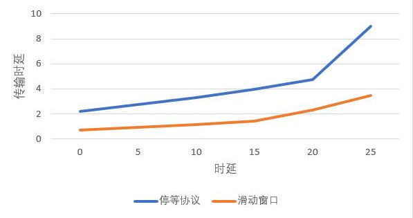
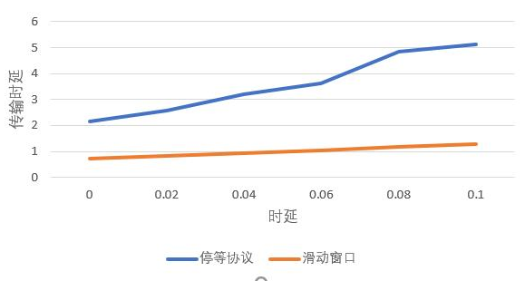
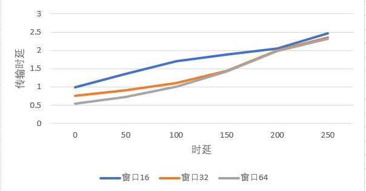
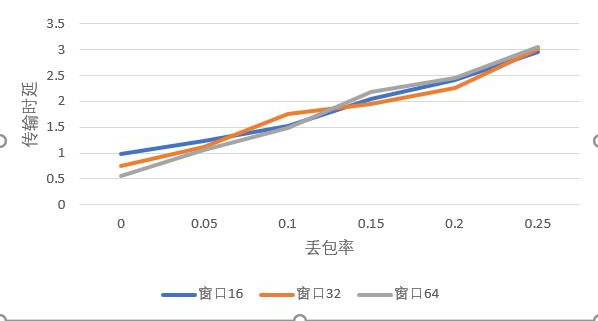
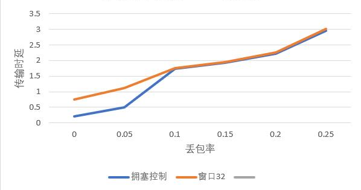

计算机网络实验报告（三）（4）
==================================

-----

>专业：计算机科学与技术
>学号：2011188
>姓名：邵琦

<!-- @import "[TOC]" {cmd="toc" depthFrom=1 depthTo=6 orderedList=false} -->

<!-- code_chunk_output -->

- [计算机网络实验报告（三）（4）](#计算机网络实验报告三4)
- [一、实验要求](#一实验要求)
- [二、实验数据](#二实验数据)
  - [停等机制与滑动窗口机制性能对比](#停等机制与滑动窗口机制性能对比)
    - [改变时延](#改变时延)
    - [改变丢包](#改变丢包)
  - [滑动窗口机制中不同窗口大小对性能的影响](#滑动窗口机制中不同窗口大小对性能的影响)
    - [改变时延](#改变时延-1)
    - [改变丢包](#改变丢包-1)
  - [有拥塞控制和无拥塞控制的性能比较](#有拥塞控制和无拥塞控制的性能比较)

<!-- /code_chunk_output -->

# 一、实验要求

基于UDP服务设计可靠传输协议并编程实现（4）

基于给定的实验测试环境，通过改变延迟时间和丢包率，完成下面3组性能对比实验：

（1）停等机制与滑动窗口机制性能对比；

（2）滑动窗口机制中不同窗口大小对性能的影响；

（3）有拥塞控制和无拥塞控制的性能比较。

# 二、实验数据

为了方便进行对比分析，均采取1.jpg进行测试。

## 停等机制与滑动窗口机制性能对比

### 改变时延

从图中我们可以看出，GBN的性能要好于停等机制。原因可能是没有受到丢包的影响，所有数据包正常到达，影响时延的主要因素为传输的延迟时间，如此，GBN的优势便会显现出来。

### 改变丢包

从图中我们可以看出，GBN的性能要好于停等机制。由于是流水线以及滑动窗口的存在，理论上来说，GBN的性能应该能够达到停等机制的五倍，然而并没有，原因可能是存在端端延迟以及文件读写和处理等操作，性能并不理想。随着丢包率上升，GBN的优势也更加明显。

## 滑动窗口机制中不同窗口大小对性能的影响

### 改变时延

从图中我们可以看出，在时延较小时，窗口越大，性能就越好，但当时延变大时，性能反而变差。原因可能是，当时延变大，窗口更大的GBN反而会有更大的超时重传开销，因此性能更差。

### 改变丢包

与改变时延类似，在丢包率较小时，窗口越大，性能就越好，但当丢包率变大时，性能反而变差。原因可能是，在丢包率较小时，影响GBN的重传较少发生，GBN的性能随着窗口变大而增强；当丢包率变大，窗口更大的GBN反而会有更大的超时重传开销，因此性能更差。

## 有拥塞控制和无拥塞控制的性能比较

在增加拥塞控制之后，很明显看出性能得到了提高。但是由图不难发现，随着丢包率升高，拥塞控制的性能反而变差了，猜测可能是由于丢包率升高，超时重传所消耗的性能过高，若传输更大的文件，性能提高效果会更好。